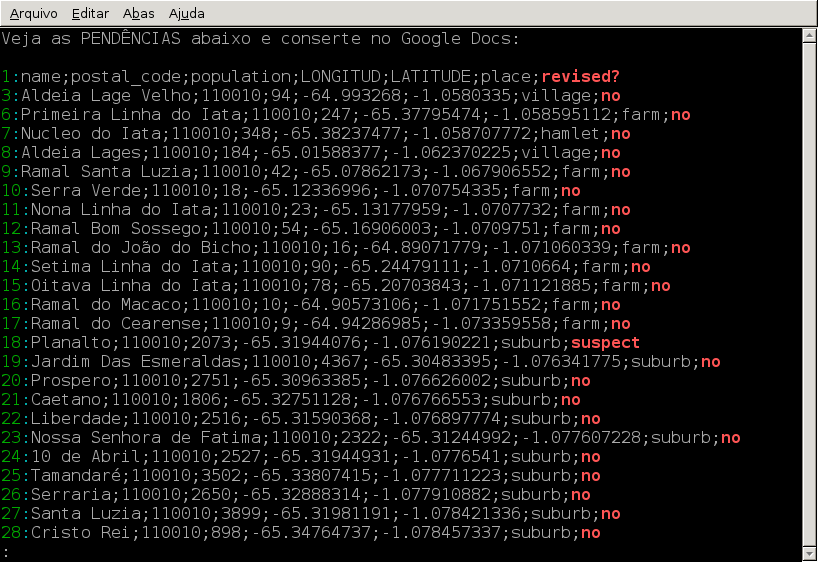

# csv-to-the-openstreetmap-community

É um assistente para se preparar/revisar colaborativamente um arquivo CSV destinado a importação no OpenStreetMap.

Esteja atento às permissões de uso dos dados que for trabalhar/importar. Os dados de [`sisloc-source.csv`](sisloc-source.csv) está neste respositório só a título de exemplo e permissões para o uso efetivo deles **não** estão implícitas. Por favor considere as [questões de licença](#Licença).

# Como usar

Para instalar, veja as dependências no cabeçalho de `convert-and-analize.sh`.

Para usar, no diretório atual execute:
```bash
$ bash convert-and-analize.sh
```

Ele fará melhorias e converterá `sisloc-source.csv` em `sisloc-planilha.xlsx`, arquivo que é usado para gerar planilha de revisão humana colaborativa no Google Docs.

Depois da revisão no Google Docs, valide-a:
```bash
$ bash from-google-docs.sh
```

Não vá à importação sem chegar até aqui.

# Uma ideia do que é este projeto...

1. Diff das melhorias que `convert-and-analize.sh` faz no CSV


2. Possíveis erros que não se conseguiu tratar


3. Tudo está pronto para a etapa de revisão colaborativa humana?


4. Então agora você coloca a planilha no Google Docs!


5. Formate-a como abaixo, configurando "formatação condicional" colorida


6. Depois do trabalho colaborativo, exporte `sisloc-planilha - data.`**`tsv`** e gere o CSV final


# Licença

O csv-to-the-openstreetmap-community é disponibilizado sob a [Expat License](LICENSE), também conhecida ambiguamente como "[MIT License](https://en.wikipedia.org/wiki/Expat_License)" — existe mais de uma "licença do MIT".

**Atenção com os dados!** Solucione esta questão ANTES DE MAPEAR:

Os dados exemplificados com [`sisloc-source.csv`](sisloc-source.csv) foram compartilhados por Alexandre Weifels — não eu, Alexandre Magno — e estão sendo usados como "exemplo" e motivação no desenvolvimento deste projeto porque, segundo Weifels, estão licitamente destinados a uma importação no OpenStreetMap. Porém, **não** me consta que haja solicitação e recebimento de permissão para o aproveitamento deles em mapeamento OpenStreetMap.
